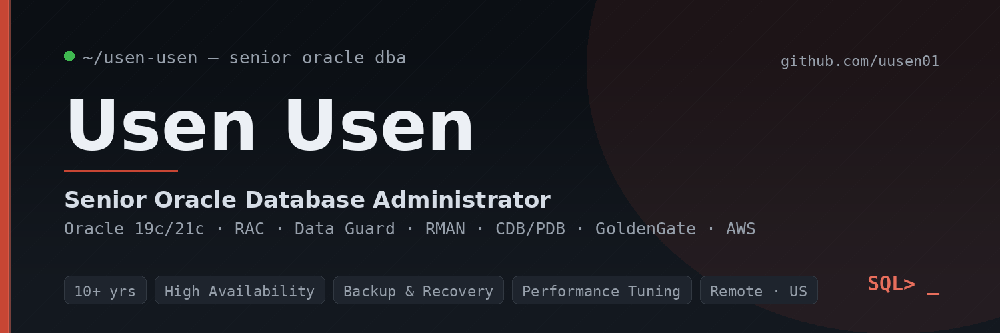

<!-- =========================================================
     GitHub Profile README — uusen01/uusen01
     Place this file and banner.png in the root of the
     special repository named exactly "uusen01".
     ========================================================= -->

<p align="center">
  
</p>

<h1 align="center">Usen Usen</h1>

<p align="center">
  <strong>Senior Oracle Database Administrator</strong><br>
  Oracle 19c/21c · RAC · Data Guard · RMAN · Performance Tuning · CDB/PDB · GoldenGate · AWS
</p>

<p align="center">
  <a href="https://www.linkedin.com/in/usen-usen"></a>
  <a href="https://github.com/uusen01"></a>
  
  
</p>

<p align="center">
  <em>I keep mission-critical Oracle databases available, recoverable, and fast — and I publish the scripts and runbooks that prove it.</em>
</p>

---

## About Me

Senior Oracle DBA with **10+ years** supporting enterprise Oracle databases across **telecommunications (AT&T)**, **automotive (General Motors)**, and **government / postal — USPS mail-processing** systems, complemented by a graduate background in **healthcare informatics**. My work centers on the operations that keep production online under real pressure: high availability, backup and recovery, performance tuning, patching, and multitenant administration.

I believe a DBA's credibility is best shown, not claimed — so my portfolio is a set of **runnable, sanitized repositories** with real scripts, sample output, and operational walkthroughs.

<table>
<tr><td valign="top" width="50%">

**Core focus**
- Oracle 19c / 21c (11g / 12c)
- Real Application Clusters (RAC)
- Automatic Storage Management (ASM)
- Data Guard (physical standby)
- RMAN backup & recovery

</td><td valign="top" width="50%">

**Also strong in**
- Performance Tuning (AWR / ASH / SQL)
- Multitenant CDB / PDB
- Oracle GoldenGate replication
- Linux & Windows Server
- SQL & PL/SQL · AWS (OCI certified)

</td></tr>
</table>

---

## Tech Stack

<p align="center">
  
  
  
  
  
  
  
  
  
</p>
<p align="center">
  
  
  
  
  
  
</p>

---

## Featured Repositories

> **Ten** sanitized, production-style Oracle repositories — each with runnable scripts/runbooks, annotated sample output, and an **Operational Screenshots (Proof of Work)** section. Demo data only (`ORADEMO`); no client identifiers.

<table>
<tr>
<td width="50%" valign="top">

### 🩺 [oracle-health-checks](https://github.com/uusen01/oracle-health-checks)
Read-only daily health-check suite — availability, space, recoverability, and performance in a repeatable 10–15 minute pass.
<br><br>
**Tech:** SQL\*Plus · V$/GV$ · RAC-aware · multitenant-aware
<br>
**Oracle:** 19c · 21c

</td>
<td width="50%" valign="top">

### 💾 [oracle-rman-scripts](https://github.com/uusen01/oracle-rman-scripts)
Production RMAN library — full/incremental backups, control-file protection, validation, and restore/recovery playbooks with a 14-day window.
<br><br>
**Tech:** RMAN · ARCHIVELOG · point-in-time recovery
<br>
**Oracle:** 11g · 12c · 19c · 21c

</td>
</tr>
<tr>
<td width="50%" valign="top">

### 📈 [oracle-performance-tuning](https://github.com/uusen01/oracle-performance-tuning)
Top-down, DB-Time-first diagnostics — wait events, ASH, AWR, and top-SQL ranking that lead to one root cause.
<br><br>
**Tech:** AWR · ASH · V$ · SQL tuning
<br>
**Oracle:** 11g · 12c · 19c · 21c

</td>
<td width="50%" valign="top">

### 🛠️ [oracle-patching-runbooks](https://github.com/uusen01/oracle-patching-runbooks)
Step-by-step Release Update, OPatch, rolling-RAC, Data Guard standby-first, and emergency rollback procedures.
<br><br>
**Tech:** OPatch · datapatch · opatchauto · flashback
<br>
**Oracle:** 19c · 21c

</td>
</tr>
<tr>
<td width="50%" valign="top">

### 🧱 [oracle-cdb-pdb-administration](https://github.com/uusen01/oracle-cdb-pdb-administration)
Multitenant operations from `CDB$ROOT` — PDB state & SAVE STATE, services, sizing, per-PDB parameters, and undo.
<br><br>
**Tech:** Multitenant · CDB_* views · SAVE STATE
<br>
**Oracle:** 12c · 18c · 19c · 21c

</td>
<td width="50%" valign="top">

### 📟 [oracle-dba-runbooks](https://github.com/uusen01/oracle-dba-runbooks)
The on-call operations playbook — daily checklist, startup/shutdown, incident response, and a blameless post-incident template.
<br><br>
**Tech:** Incident response · blocking · space · listener
<br>
**Oracle:** 19c · 21c

</td>
</tr>
<tr>
<td width="50%" valign="top">

### 🔁 [oracle-goldengate-configs](https://github.com/uusen01/oracle-goldengate-configs)
GoldenGate replication monitoring, lag detection, and recovery — sanitized configs plus Extract/Replicat troubleshooting runbooks.
<br><br>
**Tech:** GoldenGate · Extract/Replicat · heartbeat lag
<br>
**Oracle:** 11g–21c

</td>
<td width="50%" valign="top">

### 🛡️ [oracle-dataguard-runbooks](https://github.com/uusen01/oracle-dataguard-runbooks)
Data Guard administration & DR — switchover, failover, archive-gap resolution, DGMGRL broker operations, and standby-first patching.
<br><br>
**Tech:** Data Guard · DGMGRL · switchover/failover · gap resolution
<br>
**Oracle:** 11g · 12c · 19c · 21c

</td>
</tr>
<tr>
<td width="50%" valign="top">

### 🧩 [oracle-rac-administration](https://github.com/uusen01/oracle-rac-administration)
RAC & clusterware operations — crsctl/srvctl, ASM diskgroup checks, service relocation, rolling maintenance, and node-eviction triage.
<br><br>
**Tech:** crsctl · srvctl · ASM · interconnect
<br>
**Oracle:** 11g · 12c · 19c · 21c

</td>
<td width="50%" valign="top">

### ⚙️ [oracle-automation-toolkit](https://github.com/uusen01/oracle-automation-toolkit)
PowerShell, Python & SQL\*Plus automation — scheduled health checks, RMAN/capacity reporting, alert-log parsing, and HTML/email delivery.
<br><br>
**Tech:** PowerShell · Python · SQL\*Plus · scheduling
<br>
**Env:** 19c/21c · Windows · Linux

</td>
</tr>
</table>

<p align="center">
  ➡️ <strong><a href="https://github.com/uusen01?tab=repositories">View all repositories →</a></strong>
</p>

---

## Proof of Work

Real production activities reflected across the repositories above:

| | Activity | Where it shows |
|---|---|---|
| ✓ | **Daily health checks** | `oracle-health-checks` — availability, space, recoverability pass |
| ✓ | **Backup & recovery procedures** | `oracle-rman-scripts` — backup, validate, restore/recover playbooks |
| ✓ | **Performance tuning** | `oracle-performance-tuning` — wait/ASH/AWR root-cause method |
| ✓ | **Patching procedures** | `oracle-patching-runbooks` — RU, rolling RAC, datapatch, rollback |
| ✓ | **Incident response** | `oracle-dba-runbooks` — blocking, ORA-00257, listener, post-incident |
| ✓ | **Multitenant administration** | `oracle-cdb-pdb-administration` — PDB SAVE STATE, services, undo |
| ✓ | **Troubleshooting** | `oracle-goldengate-configs` — Extract/Replicat abends, lag, discards |
| ✓ | **Disaster recovery & failover** | `oracle-dataguard-runbooks` — switchover, failover, gap resolution, reinstate |
| ✓ | **RAC & clusterware operations** | `oracle-rac-administration` — crsctl/srvctl, ASM, service relocation, node eviction |
| ✓ | **Automation & reliability** | `oracle-automation-toolkit` — scheduled checks, reporting, alert-log parsing (PowerShell/Python) |

<details>
<summary><strong>How I work (click to expand)</strong></summary>

<br>

- **Recoverability before change** — never patch what I can't recover; validate restores, not just backups.
- **Root cause, not symptom** — measure where DB time goes, attribute it, change one thing, re-measure.
- **Verify, don't assume** — confirm each RAC node is ONLINE before the next; confirm source↔target *in sync*, not just "running."
- **Write it down** — runbooks that a tired engineer can follow at 2 a.m., with exact commands and a defined rollback.

</details>

---

## Technical Case Studies

> Long-form write-ups of real (sanitized) production work. *Replace the `#` placeholders with your published LinkedIn/Medium URLs.*

| # | Case Study | Topic |
|---|---|---|
| 1 | [Recoverability Before Patching Oracle 21c](#) | ARCHIVELOG conversion · RMAN · safe patching |
| 2 | [Eliminating a Recurring PDB Startup Outage](#) | Multitenant · `SAVE STATE` · availability |
| 3 | [Rolling RAC Release Updates with Minimal Downtime](#) | RAC · opatchauto · Data Guard pre-checks |
| 4 | [Recovering GoldenGate Replication Lag](#) | GoldenGate · Extract/Replicat · no data loss |
| 5 | [From "Database Slow" to One Root Cause](#) | AWR/ASH · wait events · SQL tuning |

---

## Blog Articles

> Latest writing on Oracle operations, reliability, and performance. *Add your published links below.*

| Platform | Article | Link |
|---|---|---|
| LinkedIn | *Recoverability Before Patching: Risk → Routine* | [Read →](#) |
| Medium | *Reading an AWR Report Top-Down* | [Read →](#) |
| LinkedIn | *opatch vs datapatch: the two-step half of patchers miss* | [Read →](#) |
| Medium | *The PDB That Wouldn't Open* | [Read →](#) |

📫 More on **[LinkedIn](https://www.linkedin.com/in/usen-usen)**.

---

## Certifications

| Credential | Issuer |
|---|---|
| Oracle Cloud Infrastructure — Foundations Associate | Oracle |
| Oracle Cloud Data Management — Foundations Associate | Oracle |
| Oracle Cloud Infrastructure — AI Foundations Associate | Oracle |
| OCI GoldenGate Workshop | Oracle |
| Graduate Certificate — Information Security & Assurance | Kennesaw State University |

---

## Education

| Degree | Institution |
|---|---|
| M.S., Information Security & Assurance | Kennesaw State University |
| M.S., Healthcare Management & Informatics | Kennesaw State University |

---

## Current Focus

```text
▸ Oracle automation            — PowerShell/Python health checks, reporting, scheduling
▸ High availability & DR        — RAC clusterware ops + Data Guard switchover/failover
▸ GoldenGate administration     — monitoring, lag detection, and recovery patterns
▸ Performance engineering       — top-down, DB-Time-first tuning methodology
▸ Cloud database architecture   — Oracle on AWS / OCI; HA & DR design
▸ Database reliability          — runbooks, SLOs, and blameless incident review
```

---

## Connect With Me

<p align="center">
  <a href="https://www.linkedin.com/in/usen-usen"></a>
  <a href="https://github.com/uusen01"></a>
  
  
</p>

---

<p align="center">
  
</p>

<p align="center"><sub>All repositories use sanitized, fictional demo data (<code>ORADEMO</code>) — no production, employer, or confidential information.</sub></p>
